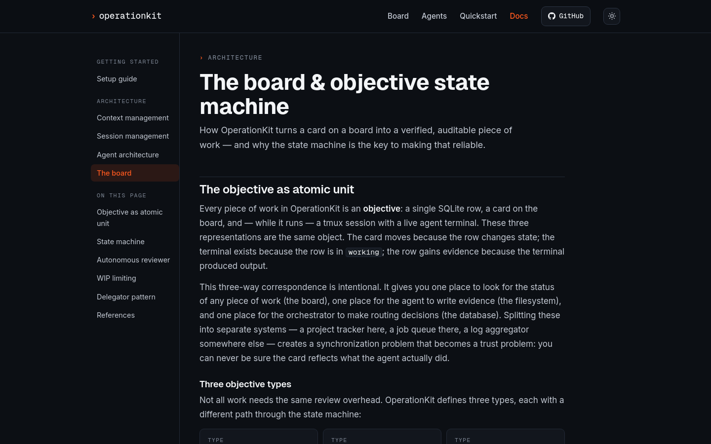

# OperationKit

**Self-hosted AI operations board** — infrastructure you run on a VPS you own. You open a card, pick a model, and an agent session starts. Your data, your machine, your subscriptions.

The OperationKit documentation site — the board & objective state machine reference. Click through for the full docs.

## What you get

A Kanban board of jobs. Each card is an objective: you describe what you want done, the platform assigns it to an agent session, and the card moves through queue → working → review → done. Pick your model per objective:

- **Claude** (Anthropic), **Grok** (xAI), or **OpenAI** (GPT-4o / o-series) as native engines
- **Any OpenAI-compatible endpoint** (Ollama, Together, Mistral, or any provider) via the bundled LiteLLM proxy

Data stays on your machine. Credentials stay on your machine. Agent sessions run in tmux under Docker on the droplet you control — no third-party session management.

**Multi-workspace from the start.** Each workspace scopes objectives, users, integrations, and credentials to a project or team. Multiple users can share a workspace; one user can belong to many. The board is mobile-capable.

## Get started

The recommended path is a DigitalOcean Ubuntu droplet with automatic HTTPS, running the full stack in ~30 minutes:

1. **[docs/DIGITALOCEAN.md](./docs/DIGITALOCEAN.md)** — create the droplet, point DNS, and run the installer
2. **[docs/SETUP.md](./docs/SETUP.md)** — first login, seeding users, and creating your first objective
3. **[docs/OVERVIEW.md](./docs/OVERVIEW.md)** — a one-sitting mental model of how the platform works

Manual install on any Linux host? Start at [docs/SETUP.md](./docs/SETUP.md) directly.

## Docs

Two places, same project: the **Markdown docs in this repository** are the source of
truth and version with the code, and the **rendered docs site** at
[m1keluka.github.io/operationkit-site/docs/](https://m1keluka.github.io/operationkit-site/docs/)
is the same material with navigation and search.

| | |
|---|---|
| **Get started (DigitalOcean)** | [docs/DIGITALOCEAN.md](./docs/DIGITALOCEAN.md) |
| **Setup & first login** | [docs/SETUP.md](./docs/SETUP.md) |
| **How it works** | [docs/OVERVIEW.md](./docs/OVERVIEW.md) |
| Product guide | [docs/product/README.md](./docs/product/README.md) |
| Architecture | [docs/architecture/README.md](./docs/architecture/README.md) |
| Agent / HTTP API | [docs/api/README.md](./docs/api/README.md) |
| Credentials reference | [docs/CREDENTIALS.md](./docs/CREDENTIALS.md) |
| Security / threat model | [SECURITY.md](./SECURITY.md) |
| Human docs (setup, guides) | [https://m1keluka.github.io/operationkit-site/docs/](https://m1keluka.github.io/operationkit-site/docs/) |

## Security

Built to be a respectable self-host: TLS via Caddy, fail-loud secrets, login throttle, CSP, signed webhooks. It is not PE-diligence / SOC 2 SaaS — the Docker socket and auto-approved agent sessions are the product, documented as such. Read [SECURITY.md](./SECURITY.md) before you expose it to a network.

## Support

Bugs go to [Issues](https://github.com/m1keluka/OperationKit/issues); questions go to
[Discussions](https://github.com/m1keluka/OperationKit/discussions). See
[SUPPORT.md](./SUPPORT.md). Release notes live in [CHANGELOG.md](./CHANGELOG.md).

## License

Apache-2.0 — see [LICENSE](./LICENSE) and [NOTICE](./NOTICE).

Third-party dependencies carry their own licenses; the ones with obligations worth
knowing about (notably BlockNote under MPL-2.0) are recorded in
[THIRD-PARTY-NOTICES.md](./THIRD-PARTY-NOTICES.md).
