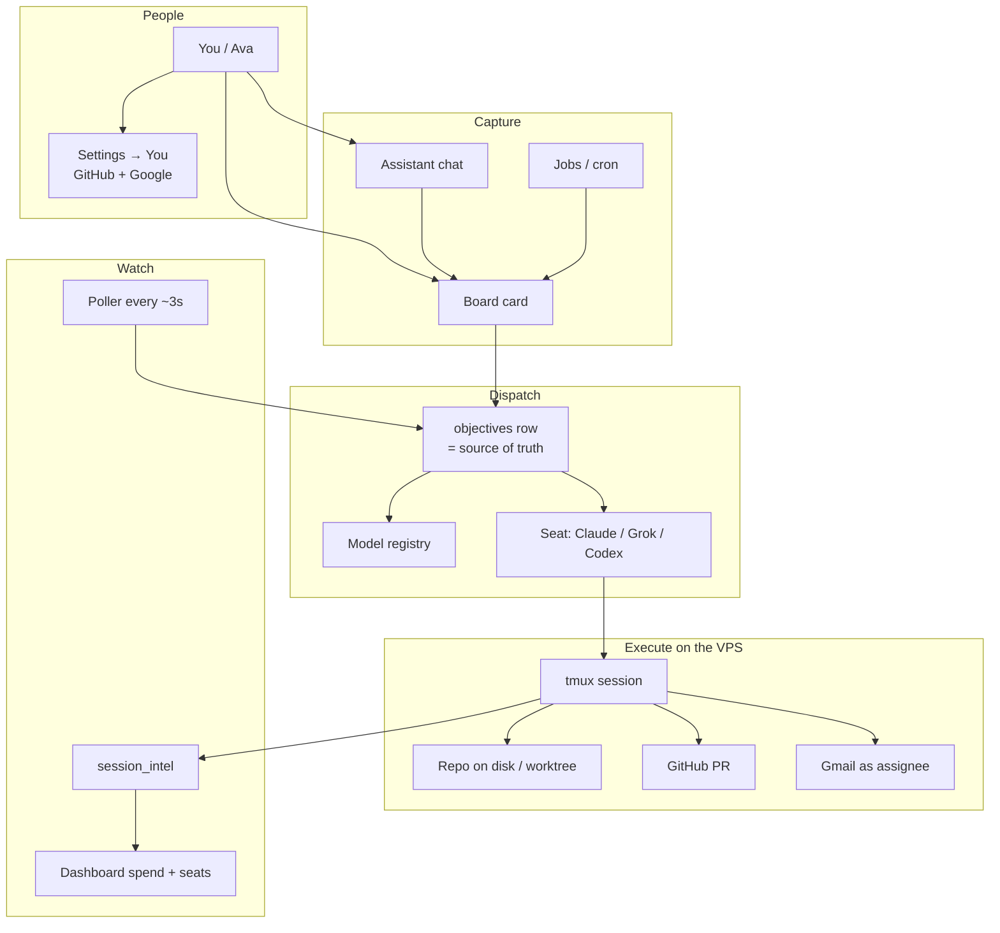

# What Command Center is

Command Center (`cc.example.com`) is Example’s control plane for AI work. It is not a chatbot with a file picker. It is a **kanban of jobs** that become **live agent sessions** on a single VPS, with the same GitHub, Google, and repos we already use.

If you think in pictures, start with the chart. If you think in words, skip to **The loop**. Tables and databases sit in [Data](./07-data.md).

## The loop

Someone captures work (you, Assistant, a Job, a meeting). It becomes an **objective** on the Board. Dispatch picks a **subscription seat** (Claude OAuth, SuperGrok, or ChatGPT/Codex) and a **model**. Execute is a tmux session on the host: the agent edits `/home/operator/projects/…`, opens a PR when asked, talks in the card. The **board status** is truth — not the agent’s last sentence. When the session dies, intel lands, and a human (or a Job) decides what happens next.

## Who it is for

Mike and teammates (Ava, …). Everyone has their own login. Work is organized by **organization** (workspace): Example, Example Project, Example3, and others. A card is assigned to a person; that person is who the agent acts as for mail and git.

## What you see every day

- **Board** — create and run work
- **Assistant** — talk to the system
- **Jobs** — recurring work
- **More → Content, Docs, Dashboard** — publish, vault, seats/spend/host
- **Avatar → Settings** — You (GitHub, Google, assistant, personal secrets), Secrets, Org, Agents, Platform

Unfinished surfaces (Contacts, Strategies, Development, Notes, Status, Feed) still exist at their URLs and in ⌘K. They are not the product yet.

## What it is not

- Not a shared Google/GitHub identity. Assigned user wins.
- Not API-key billing for the coding agents. Claude, Grok, and Codex run on **subscriptions**.
- Not “rebuild the Docker image for a TypeScript change.” That kills every live session. Code deploys restart Node only.

## One screen of truth

If the Board disagrees with the transcript, trust the Board, then go read the session. If spend looks wrong, trust Dashboard, then the account cards. If mail went out as the wrong person, check Settings → You and the card’s assignee.
