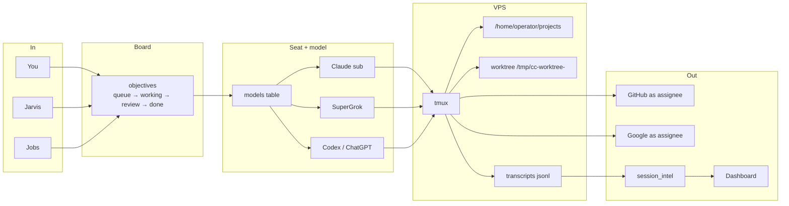

# How it works

The **objective** row is the source of truth. An agent finishing a sentence does not finish the card. Same story as a picture:

## Engines

| Engine | When | Auth |
| --- | --- | --- |
| Claude | Default coding / most cards | Claude subscription seats (rotation A–G). Connect on Dashboard. |
| Grok | Model `grok-4.6` | SuperGrok subscription. Dashboard → Grok → Connect (device code). Not an API key. |
| Codex | GPT-5.x models | ChatGPT subscription in the Codex home. |

Spawn unsets provider API keys so a session cannot silently fall through to pay-as-you-go.

## Seats vs people

- **Seats** = Claude / Grok / Codex subscriptions. Shared, rotated, named on Dashboard.
- **People** = OperationKit users. GitHub PAT + Google OAuth on Settings → You.
- A card’s **assignee** is who the session acts as. If nobody is assigned, the creator.

## Where code lives

Sessions run as `ccuser` with `HOME` pointed at a seat directory. A card with a linked repo always works in `/tmp/cc-worktree-<id>/`, not the live checkout. The “open a PR” checkbox only chooses how the branch ships (own PR vs fold into a parent). Editing the live tree crashed production once; a hook now blocks those writes.

A PR is green when GitHub Actions job **`gate`** is green. That is the merge lock. An AI review may also comment; it is not the required check.

## What watches

A poller looks at tmux every few seconds: working vs waiting, death, rate limits, review. Dashboard spend is derived from session intel, not from the seat counters (those double-count follow-ups).
