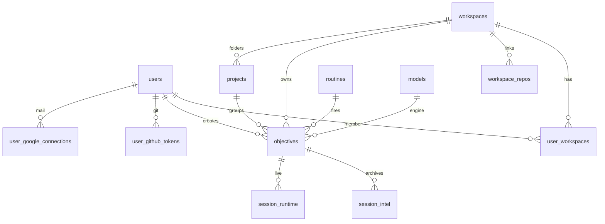

# Data — tables, files, other stores

If you think in pictures: the spine is below. If you think in words: the grouped list after it. The daily **docs-breathe** Job must keep this page’s inventory matching `CREATE TABLE` in `app/server/src/db/schema/`.

One SQLite file runs the product: **`/app/data/command-center.db`** (host: `/home/operator/data/command-center/command-center.db`).

## Spine (the cards, people, and sessions)

How to read it: a **person** belongs to **organizations**. An organization links **GitHub repos**. A **card** (`objectives`) belongs to an org, maybe a repo, and an assignee. **Routines** mint cards. A live session hangs off the card; when it ends, **session_intel** is what Dashboard spend trusts. **models** says Claude vs Grok vs Codex.

## Grouped by job (words)

| You use | Tables that back it |
| --- | --- |
| Login, orgs, who’s on the team | `users`, `user_workspaces`, `workspaces` |
| Board cards | `objectives`, `objective_assignees`, `objective_prs`, `blocked_objectives`, `projects` |
| Jobs / cron | `routines` |
| Live session | `session_runtime`, `session_events`, `session_file_ops`, `session_leases`, `branch_leases` |
| Spend / “what happened” | `session_intel`, `session_usage_daily`, `activity_log` |
| GitHub as you | `user_github_tokens` |
| Google as you | `user_google_connections` |
| Secrets | `secrets`, `secret_versions`, `secret_access_log` |
| Jarvis | `mentor_threads`, `mentor_summaries`, `thread_folders`, `assistant_configs` |
| Linked repos | `workspace_repos`, `workspace_integrations` |
| Models on Dashboard | `models` |
| Reviewer QA logins | `test_credentials` |
| Host flags | `settings` |

Hidden chrome (still in the DB): `dev_items*` (Development), `contacts_index`, `granola_*`, `uptime_events`, DSR/canary/UAT/kitchen/drift tables. They are real; they are not the daily product.

## Not SQLite

| Store | What |
| --- | --- |
| `account-router-state.json` | Claude/Grok/Codex **seats** (names, benches). Not a SQL table. |
| tmux + `/home/operator/transcripts` | The actual agent process and jsonl |
| `/home/operator/projects/…` | Git checkouts the agents edit |
| `/home/operator/second-brain` | Vault Docs reads/writes |
| `/home/ccuser-*`, `/app/data/cc-accounts/grok` | Subscription homes (OAuth files) |
| LiteLLM Postgres | Sibling LLM proxy — **not** Command Center’s DB |
| Caddy | TLS in front of `:3002` |

## Full SQLite inventory

Generated from `app/server/src/db/schema/*.ts` (`CREATE TABLE IF NOT EXISTS`). If a name appears in schema and not here, the breathe Job must add it.

`alerts` · `assistant_configs` · `activity_log` · `blocked_objectives` · `branch_leases` · `canary_runs` · `changelog_entries` · `contacts_index` · `dev_ingest_idempotency` · `dev_item_attachments` · `dev_item_notes` · `dev_item_prs` · `dev_items` · `doppler_scoped_tokens` · `dsr_candidates` · `dsr_fingerprints` · `dsr_lens_misses` · `dsr_runs` · `dsr_signal_stats` · `external_check_remediations` · `gmail_triage` · `granola_action_items` · `granola_processed_meetings` · `kitchen_loop_runs` · `loop_drift_metrics` · `mentor_summaries` · `mentor_threads` · `models` · `objective_assignees` · `objective_audit` · `objective_floor_runs` · `objective_learnings` · `objective_prs` · `objective_reviews` · `objective_uat_runs` · `objectives` · `planning_conversations` · `projects` · `resource_assignments` · `rolodex_threads` · `routines` · `scratchpads` · `secret_access_log` · `secret_versions` · `secrets` · `session_account_override` · `session_corrections` · `session_events` · `session_file_ops` · `session_intel` · `session_leases` · `session_runtime` · `session_usage_daily` · `settings` · `test_credentials` · `thread_folders` · `uptime_events` · `user_github_tokens` · `user_google_connections` · `user_workspaces` · `users` · `workspace_integrations` · `workspace_repos` · `workspaces`

Also created in `db/index.ts` (not the schema folder): `schema_meta`, `gate_false_pass`, `projects` (+ `project_id` column on `objectives`).
